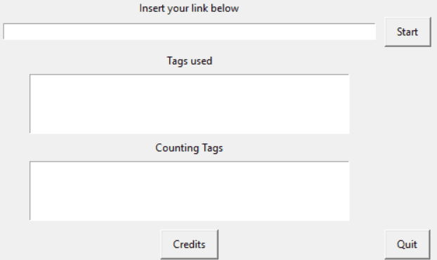

# Tags Collecter GUI

This is a GUI developed with Python and Tkinter module and will help get html tags of any url provided.

## Demo

## Credits

[Center a Tkinter Window on the screen](https://www.youtube.com/watch?v=TdTks2eSx3c)
